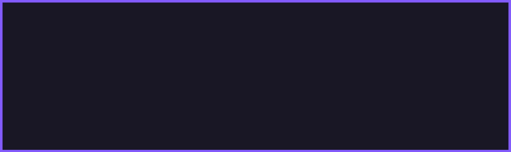
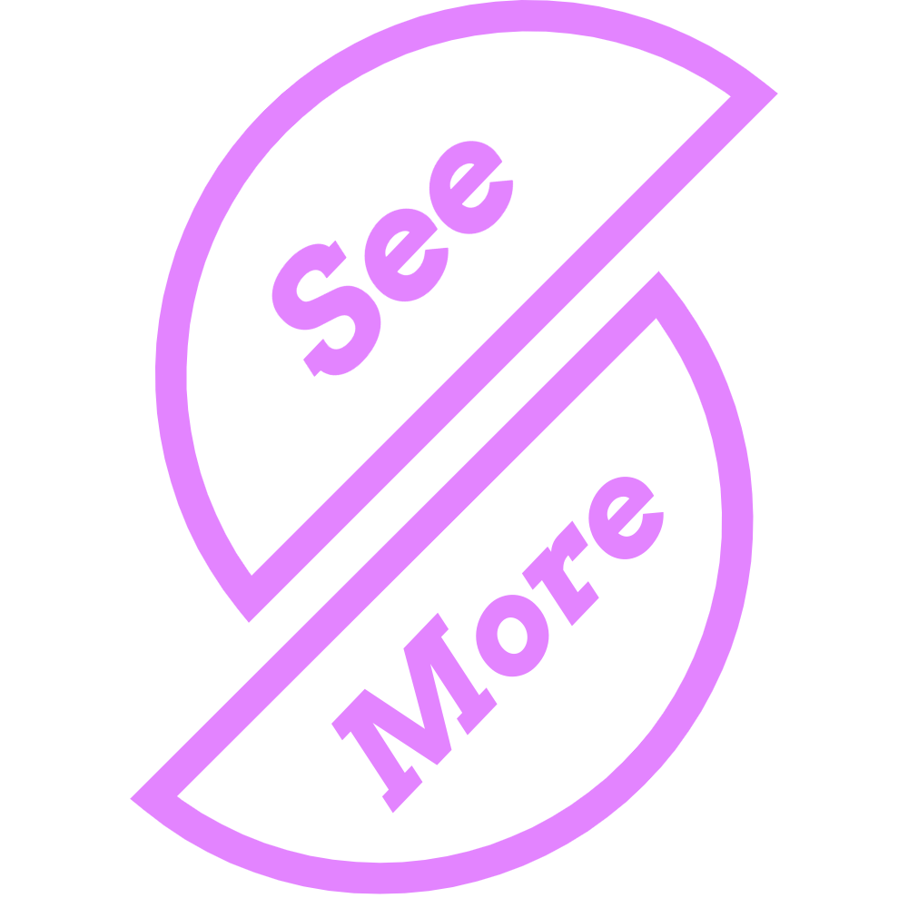

<!-- Main image -->
<p align="center">
    
</p>


<!-- Header & Description -->
<h1 align="center">
    Hey, I'm Hirusha 👋
</h1>
<p align="center">A random teenager from the Teardrop of India 🏝️</p>


<!-- Nav buttons -->
<p align="center">
    <kbd> <br> <a href="#about">About</a> <br> </kbd>
    <kbd> <br> <a href="#stats">Stats</a> <br> </kbd>
    <kbd> <br> <a href="#projects">Projects</a> <br> </kbd>
    <kbd> <br> <a href="#contact">Contact</a> <br> </kbd>
</p>


<!-- About section -->

## About

```js
{
    "name": "Hirusha",
    "age": 17,
    "occupation": "Student",
    "hobbies": "Doing what I love ;)"
}
```

<h3 align="center">Languages I ❤️‍🔥</h3>
<p align="center">
    
    
    
    
    
    
</p>

<h3 align="center">OS I ❤️‍🔥</h3>
<p align="center">
    
    
    
    
</p>

<h3 align="center">Frameworks and tools 👨‍🔬</h3>
<p align="center">
    
    
    
    
    
</p>


<!-- Stats section -->
## Stats

<h4 align="center">
  
</h4>

<p align="center">
  </img>
</p>


<!-- Projects section -->
## Projects
Here are some of the projects that I actively maintain,

- [**Zephyr**](https://github.com/Itz-fork/Zephyr) - Minimal class-less css stylesheet
- [**Kivi.py**](https://github.com/Itz-fork/Kivi.py) - JSON based python key-value database for rapid prototyping
- [**py-trans**](https://github.com/Itz-fork/py-trans) - Text translation library with wrappers for Google Translate, My memory and more...

<p align="center">
    <a href="https://github.com/Itz-fork?tab=repositories&q=&type=&language=&sort=stargazers">
        
    </a>
</p>


<!-- Contact section -->
## Contact

<p align="center">
  <a href="https://t.me/Bruh_0x"></a>
  <a href="mailto:git.itzfork@gmail.com"></a>
</p>
